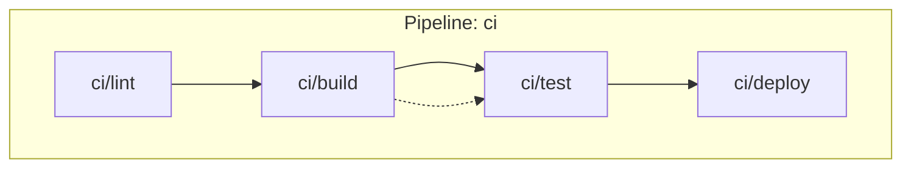

# Graph visualization

> **Work in progress.** Mermaid output is specified (Spec 39) but not yet
> implemented. This page describes the planned interface.

Enhance `sverka graph` with Mermaid diagram output. `--format mermaid`
emits a Mermaid flowchart to stdout showing the construct tree (subgraph
per pipeline) and execution DAG with color-coded dependency edges. No
interactive TUI — Mermaid renders in any markdown viewer (GitHub, GitLab,
VS Code).

## Usage

```bash
# Mermaid flowchart to stdout
sverka graph --format mermaid

# Write to file
sverka graph --format mermaid --output diagram.mmd

# Default: tree view (existing)
sverka graph

# JSON format (existing)
sverka graph --format json
```

## What the diagram shows

- **Subgraph per pipeline** — each pipeline is a Mermaid subgraph.
- **Nodes for steps** — each step is a node labeled with its ID.
- **Color-coded edges:**
  - **Solid (`--->`)** — control dependency (ordering)
  - **Dashed (`-.->`)** — value dependency (output → input)
  - **Thick (`==>`)** — artifact dependency (artifact output → input)
- **Edge legend** in a diagram comment.

## Example output



Render this in any Mermaid-compatible viewer: GitHub markdown, GitLab
markdown, VS Code with Mermaid extension, or `mmdc` CLI.

## Limitations (v1)

- **No interactive TUI** — follow-up bead (requires terminal UI library).
- **No SVG/PNG rendering** — use `mmdc` or a markdown viewer.
- **No edge labels with output names** — follow-up (clutters diagram).
- **No real-time graph updates** — static snapshot of the definition graph.
