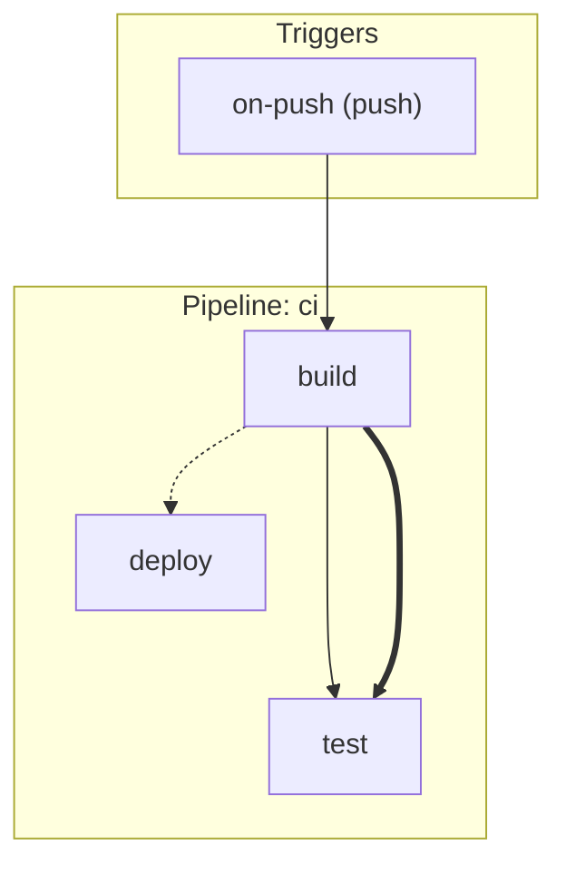

# Spec 39 — Graph Visualization

**Status:** Active
**Source:** specs/architecture-spec.md §30 (CLI: `sverka graph`), §10 (Definition Graph), §11 (References)
**Package:** `@sverka/cli` (graph command enhancement)
**Capability:** N/A (visualization, not a target/engine)
**Related:** ADR-017, Spec 17 (CLI)

## Overview

Enhance `sverka graph` with Mermaid diagram output. `--format mermaid`
emits a Mermaid flowchart to stdout showing the construct tree (subgraph
per pipeline) and execution DAG with color-coded dependency edges
(control=solid, value=dashed, artifact=dotted). No interactive TUI —
Mermaid renders in any markdown viewer (GitHub, GitLab, VS Code).

## Goals

- `sverka graph --format mermaid` → Mermaid flowchart string to stdout.
- Construct tree view: subgraph per pipeline, nodes for steps.
- Execution DAG: edges for dependencies, color-coded by kind.
- Edge legend in diagram comment.
- `sverka graph --format mermaid --output diagram.mmd` → write to file.
- No new dependencies (string templating only).

## Non-goals

- Interactive TUI — follow-up bead (requires terminal UI library).
- SVG/PNG rendering — user renders Mermaid with `mmdc` or markdown viewer.
- Graph layout customization — Mermaid handles layout.
- Real-time graph updates during execution.
- Construct tree showing nested constructs beyond pipeline/step level.
- Edge labels with output names (clutters diagram — follow-up).

## Interfaces

No new public API. CLI flag enhancement only:

```
sverka graph [--format tree|json|mermaid] [--output <path>]
```

`--format mermaid` is new; `tree` (default) and `json` (existing) unchanged.
`--output` is new (optional) — writes to file instead of stdout.

## Data models

### Mermaid output structure



### Edge mapping

| Dependency kind | Mermaid arrow |
|---|---|
| control | `-->` (solid) |
| value | `-.-> ` (dashed) |
| artifact | `==>` (thick) |

### Trigger rendering

Triggers shown as nodes in a "Triggers" subgraph, with edges to their
root steps. Trigger kind labeled in node text.

## Error handling

No new error class. Reuses existing `CliError` for invalid flags or
config load failures. `--output` to an unwritable path → `CliError`
with `SDK_ERROR` code, exit 3.

## Test plan

1. Single-pipeline graph → Mermaid with one subgraph.
2. Multi-pipeline graph → Mermaid with multiple subgraphs.
3. Control dependency → solid arrow (`-->`).
4. Value dependency → dashed arrow (`-.->`).
5. Artifact dependency → thick arrow (`==>`).
6. Trigger node → labeled with trigger kind, edge to root step.
7. `--output` writes Mermaid to file (not stdout).
8. `--format mermaid` output is valid Mermaid syntax (structural
   assertions: starts with `flowchart TD`, has subgraphs, has edges).
9. Empty pipeline (no steps) → valid Mermaid with empty subgraph.
10. Determinism: same graph → identical Mermaid output.
11. `--format tree` (default) unchanged — existing tests still pass.
12. `--format json` unchanged — existing tests still pass.
13. Legend comment present in output.
14. Step IDs with special characters (slashes) → sanitized for Mermaid
    node IDs (e.g. `ci/build` → `ci_build`).
